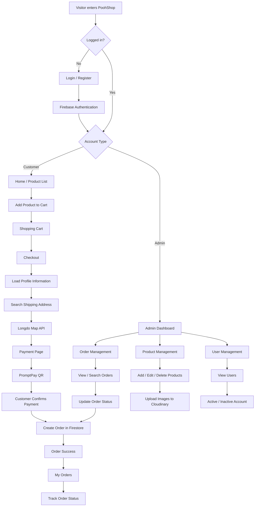

# PoohShop - Shoe E-commerce Web Application

PoohShop is a responsive e-commerce web application for an online shoe store.

The project provides both customer and administrator systems, including authentication, product browsing, shopping cart, checkout, shipping address search, PromptPay payment, order tracking, product management, order management, and user account management.

## Live Demo

https://woodpekerrr.github.io/pooh-shop/

---

## Features

### Customer

- Register a new account
- Login and logout
- Forgot password
- Edit personal profile
- Browse products
- Add products to cart
- Increase or decrease product quantity
- Remove products from cart
- View order summary
- Checkout with saved profile information
- Automatically load the latest shipping address
- Search shipping addresses using Longdo Map API
- Automatically fill district, province, and postal code
- Pay using PromptPay QR
- Create an order after payment confirmation
- View order history
- Track order status
- Active / Inactive account protection

### Admin

- Multi-admin authentication
- Admin dashboard
- View total orders
- View order status summary
- View total sales
- View recent orders
- Search and filter orders
- View order details
- Update order status
- Add products
- Edit products
- Delete products
- Upload product images using Cloudinary
- View registered users
- Activate or deactivate user accounts

---

## Tech Stack

### Frontend

- HTML5
- CSS3
- JavaScript
- ES6 Modules
- Responsive Web Design

### Backend Services

- Firebase Authentication
- Cloud Firestore

### APIs & Services

- Cloudinary
- Longdo Map API
- PromptPay QR

### Development & Deployment

- Git
- GitHub
- GitHub Pages
- Visual Studio Code

---

## Application Flow



---

## Order Flow

The order process follows this sequence:

```text
Product
   ↓
Shopping Cart
   ↓
Checkout
   ↓
Customer Information
   ↓
Shipping Address
   ↓
Longdo Address Search
   ↓
Payment
   ↓
PromptPay QR
   ↓
Customer Confirms Payment
   ↓
Create Order
   ↓
Pending Verification
   ↓
Paid
   ↓
Preparing
   ↓
Shipped
   ↓
Completed
```

An administrator can also change an order to:

```text
Cancelled
```

---

## Order Status

| Status | Description |
| --- | --- |
| Pending Verification | Waiting for the administrator to verify the payment |
| Paid | Payment has been verified |
| Preparing | The order is being prepared |
| Shipped | The order has been shipped |
| Completed | The order has been completed |
| Cancelled | The order has been cancelled |

---

## Screenshots

### Home Page

The home page displays products retrieved from the database and allows customers to add products to their shopping cart.


### Shopping Cart

Customers can view selected products, change quantities, remove products, and view the total price before checkout.


### Checkout

Customer information is automatically loaded from the user profile. The shipping address can be searched using Longdo Map API.


### Admin Dashboard

The admin dashboard provides an overview of orders, order statuses, sales, and recent orders.


---

## Project Structure

```text
pooh-shop/
│
├── css/
│   ├── admin.css
│   └── style.css
│
├── images/
│   ├── promptpay-qr.png
│   └── ...
│
├── screenshots/
│   ├── home-page.png
│   ├── cart-page.png
│   ├── checkout-page.png
│   └── admin-dashboard.png
│
├── js/
│   ├── admin-dashboard.js
│   ├── admin-orders.js
│   ├── admin-products.js
│   ├── admin-users.js
│   ├── auth.js
│   ├── cart.js
│   ├── cart-page.js
│   ├── checkout.js
│   ├── config.js
│   ├── firebase.js
│   ├── my-orders.js
│   ├── payment.js
│   ├── products.js
│   ├── profile.js
│   ├── user-status-guard.js
│   ├── user.js
│   └── utils.js
│
├── admin.html
├── admin-orders.html
├── admin-products.html
├── admin-users.html
├── cart.html
├── checkout.html
├── index.html
├── login.html
├── my-orders.html
├── payment.html
├── profile.html
├── register.html
├── .gitignore
├── .prettierrc.json
└── README.md
```

---

## Main System Components

### Authentication

Firebase Authentication is used for:

- Registration
- Login
- Logout
- Password reset

User profile information is stored separately in Cloud Firestore.

### Database

Cloud Firestore stores application data such as:

```text
users/
products/
orders/
```

### Product Images

Product images uploaded from the Admin Product Management page are stored using Cloudinary.

### Address Search

Longdo Map API is used during checkout to provide address suggestions and automatically fill shipping address information.

### Payment

PoohShop uses a PromptPay QR image as the payment method.

After the customer confirms that payment has been made, the application creates an order in Cloud Firestore with the initial status:

```text
pending_verification
```

The administrator can then verify the order and update its status.

> This project does not use an automatic payment gateway or automatic payment verification.

---

## User Account Status

Each user account can have one of the following states:

```text
active
inactive
```

An administrator can deactivate a user account.

Inactive users are prevented from accessing protected customer features.

Administrator access is handled separately using configured administrator UIDs.

---

## Security

The project uses Firebase Authentication together with Firestore Security Rules to control access to application data.

Examples include:

- Customers can access their own profile
- Customers can view their own orders
- Customers cannot update another user's profile
- Only administrators can manage products
- Only administrators can update order statuses
- Only administrators can change user Active / Inactive status

API services used by the frontend should also have domain restrictions configured for the deployed website.

---

## How to Run Locally

### 1. Clone the repository

```bash
git clone https://github.com/Woodpekerrr/pooh-shop.git
```

### 2. Open the project

```bash
cd pooh-shop
```

### 3. Run using a local web server

For example, use the **Live Server** extension in Visual Studio Code.

Open:

```text
index.html
```

with Live Server.

Because the project uses JavaScript ES6 modules, opening HTML files directly with:

```text
file://
```

is not recommended.

---

## Deployment

The project is deployed using GitHub Pages.

### Production Website

https://woodpekerrr.github.io/pooh-shop/

Deployment source:

```text
Branch: main
Directory: / (root)
```

---

## Git Workflow

After making changes to the project:

```bash
git status
git add .
git commit -m "Update project"
git push
```

GitHub Pages will deploy the latest version from the `main` branch.

---

## Future Improvements

Possible future improvements include:

- Product categories
- Product search
- Product sorting
- Stock management
- Product size selection
- Favorite / Wishlist system
- Discount codes
- Automatic payment gateway
- Automatic payment verification
- Email order notifications
- Order cancellation by customers
- Product reviews and ratings
- Improved mobile navigation
- Backend server / REST API
- Admin analytics and charts

---

## Project Purpose

PoohShop was developed as a portfolio project to practice building an e-commerce web application using frontend technologies and cloud services.

The project demonstrates experience with:

- Frontend development
- Firebase Authentication
- Cloud Firestore
- CRUD operations
- API integration
- User authentication and authorization
- Shopping cart logic
- Checkout workflow
- Order management
- Admin dashboard development
- Responsive web design
- Git and GitHub
- Web deployment

---

## Author

Developed by **Woodpekerrr**

GitHub:  
https://github.com/Woodpekerrr

---

## License

This project was created for learning and portfolio purposes.