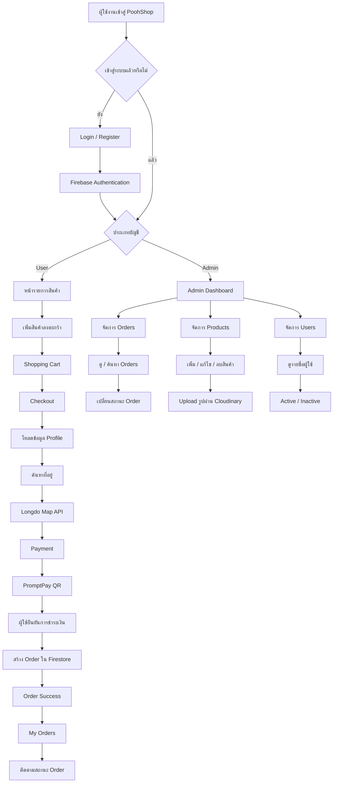

# PoohShop - เว็บแอปพลิเคชัน E-Commerce ร้านรองเท้า

PoohShop เป็นเว็บแอปพลิเคชัน E-Commerce สำหรับร้านรองเท้าออนไลน์  
พัฒนาขึ้นเพื่อเรียนรู้และฝึกใช้งานระบบ Authentication, Database, API Integration,
Shopping Cart, Checkout, Order Management และระบบ Admin

## 🌐 Live Demo

https://woodpekerrr.github.io/pooh-shop/

---
=======
## 🔐 บัญชีสำหรับทดลองระบบ
>>>>>>> e59697d (Fix screenshot filenames)

### Admin Demo

- Email: `poohshop2026@gmail.com`
- Password: กรุณาติดต่อผู้พัฒนาเพื่อขอรหัสผ่าน

> บัญชีสำหรับ Demo ควรเป็นบัญชีทดสอบที่ไม่มีข้อมูลสำคัญและมีสิทธิ์เท่าที่จำเป็น

---

## ✨ Features

### 👤 ระบบผู้ใช้งาน

- สมัครสมาชิก
- เข้าสู่ระบบ / ออกจากระบบ
- ลืมรหัสผ่าน
- แก้ไขข้อมูลส่วนตัว
- ดูรายการสินค้า
- เพิ่มสินค้าลงตะกร้า
- เพิ่ม / ลดจำนวนสินค้า
- ลบสินค้าออกจากตะกร้า
- Checkout
- ดึงข้อมูลผู้ใช้จาก Profile อัตโนมัติ
- ดึงที่อยู่จัดส่งล่าสุด
- ค้นหาที่อยู่ด้วย Longdo Map API
- กรอกเขต จังหวัด และรหัสไปรษณีย์อัตโนมัติ
- ชำระเงินด้วย PromptPay QR
- สร้างคำสั่งซื้อ
- ดูประวัติคำสั่งซื้อ
- ติดตามสถานะคำสั่งซื้อ
- ระบบ Active / Inactive Account

### 🛠️ ระบบ Admin

- รองรับ Multi Admin
- Admin Dashboard
- ดูจำนวนคำสั่งซื้อทั้งหมด
- ดูยอดขายรวม
- ดูสรุปสถานะคำสั่งซื้อ
- ดูคำสั่งซื้อล่าสุด
- ค้นหาและกรองคำสั่งซื้อ
- ดูรายละเอียดคำสั่งซื้อ
- เปลี่ยนสถานะคำสั่งซื้อ
- เพิ่มสินค้า
- แก้ไขสินค้า
- ลบสินค้า
- Upload รูปสินค้าผ่าน Cloudinary
- ดูรายชื่อผู้ใช้งาน
- เปิด / ปิดการใช้งานบัญชีผู้ใช้

---

## 🧰 Tech Stack

### Frontend

- HTML5
- CSS3
- JavaScript
- ES6 Modules
- Responsive Web Design

### Backend Services

- Firebase Authentication
- Cloud Firestore

### APIs & Services

- Cloudinary
- Longdo Map API
- PromptPay QR

### Development & Deployment

- Git
- GitHub
- GitHub Pages
- Visual Studio Code

---

## 🔄 Application Flow



---

## 📦 Order Flow

```text
เลือกสินค้า
   ↓
Shopping Cart
   ↓
Checkout
   ↓
ข้อมูลผู้รับ
   ↓
ที่อยู่จัดส่ง
   ↓
ค้นหาที่อยู่ด้วย Longdo
   ↓
Payment
   ↓
PromptPay QR
   ↓
ยืนยันการชำระเงิน
   ↓
สร้าง Order
   ↓
รอตรวจสอบ
   ↓
ชำระแล้ว
   ↓
กำลังเตรียมสินค้า
   ↓
จัดส่งแล้ว
   ↓
สำเร็จ
```

Admin สามารถเปลี่ยนสถานะคำสั่งซื้อเป็น `ยกเลิก` ได้

---

## 📋 สถานะคำสั่งซื้อ

| Status | ความหมาย |
| --- | --- |
| Pending Verification | รอตรวจสอบการชำระเงิน |
| Paid | ชำระเงินแล้ว |
| Preparing | กำลังเตรียมสินค้า |
| Shipped | จัดส่งแล้ว |
| Completed | คำสั่งซื้อสำเร็จ |
| Cancelled | ยกเลิกคำสั่งซื้อ |

---

## 📸 Screenshots

### หน้าแรก

แสดงรายการสินค้าจากระบบ และสามารถเพิ่มสินค้าลงตะกร้าได้


### ตะกร้าสินค้า

ผู้ใช้สามารถดูสินค้า เพิ่มหรือลดจำนวน ลบสินค้า และดูยอดรวมได้


### Checkout

ระบบดึงข้อมูลจาก Profile และสามารถค้นหาที่อยู่ผ่าน Longdo Map API


### Admin Dashboard

แสดงข้อมูลสรุป Orders ยอดขาย สถานะคำสั่งซื้อ และ Recent Orders


---

## 📁 Project Structure

```text
pooh-shop/
│
├── css/
│   ├── admin.css
│   └── style.css
│
├── images/
│
├── screenshots/
│   ├── home-page.png
│   ├── cart-page.png
│   ├── checkout-page.png
│   └── admin-dashboard.png
│
├── js/
│   ├── admin-dashboard.js
│   ├── admin-orders.js
│   ├── admin-products.js
│   ├── admin-users.js
│   ├── auth.js
│   ├── cart.js
│   ├── cart-page.js
│   ├── checkout.js
│   ├── config.js
│   ├── firebase.js
│   ├── my-orders.js
│   ├── payment.js
│   ├── products.js
│   ├── profile.js
│   ├── user-status-guard.js
│   ├── user.js
│   └── utils.js
│
├── admin.html
├── admin-orders.html
├── admin-products.html
├── admin-users.html
├── cart.html
├── checkout.html
├── index.html
├── login.html
├── my-orders.html
├── payment.html
├── profile.html
├── register.html
└── README.md
```

---

## 🔐 Authentication

ใช้ Firebase Authentication สำหรับ

- Register
- Login
- Logout
- Reset Password

ข้อมูล Profile ของผู้ใช้ถูกจัดเก็บใน Cloud Firestore

---

## 🗄️ Database

Cloud Firestore ใช้จัดเก็บข้อมูลหลักของระบบ

```text
users/
products/
orders/
```

---

## 🖼️ Product Images

รูปสินค้าที่เพิ่มผ่านระบบ Admin จะถูก Upload และจัดเก็บผ่าน Cloudinary

---

## 📍 Address Search

หน้า Checkout ใช้ Longdo Map API สำหรับค้นหาที่อยู่
และช่วยกรอกข้อมูลเขต จังหวัด และรหัสไปรษณีย์

---

## 💳 Payment

ระบบใช้ PromptPay QR สำหรับการชำระเงิน

เมื่อผู้ใช้กดยืนยันว่าชำระเงินแล้ว ระบบจะสร้าง Order ใน Cloud Firestore
โดยสถานะเริ่มต้นคือ

```text
pending_verification
```

จากนั้น Admin จะเป็นผู้ตรวจสอบและเปลี่ยนสถานะคำสั่งซื้อ

> ระบบนี้ยังไม่ได้ใช้ Payment Gateway หรือระบบตรวจสอบการชำระเงินอัตโนมัติ

---

## 🔒 Security

ระบบใช้ Firebase Authentication ร่วมกับ Firestore Security Rules

ตัวอย่างการควบคุมสิทธิ์:

- ผู้ใช้สามารถเข้าถึง Profile ของตัวเอง
- ผู้ใช้สามารถดู Orders ของตัวเอง
- ผู้ใช้ไม่สามารถแก้ Profile ของคนอื่น
- Admin เท่านั้นที่จัดการสินค้าได้
- Admin เท่านั้นที่เปลี่ยนสถานะ Order ได้
- Admin เท่านั้นที่เปิด / ปิดบัญชีผู้ใช้ได้

---

## 💻 วิธีเปิดโปรเจกต์ในเครื่อง

Clone Repository

```bash
git clone https://github.com/Woodpekerrr/pooh-shop.git
```

เข้าโฟลเดอร์

```bash
cd pooh-shop
```

จากนั้นเปิดโปรเจกต์ด้วย Visual Studio Code และใช้งานผ่าน Live Server

---

## 🚀 Deployment

เว็บไซต์ถูก Deploy ผ่าน GitHub Pages

https://woodpekerrr.github.io/pooh-shop/

```text
Branch: main
Directory: / (root)
```

---

## 🔮 Future Improvements

ฟีเจอร์ที่มีแผนพัฒนาต่อ:

- Stock Management
- Size / Variant
- Product Search / Filter
- Payment Gateway
- Email Notification
- Coupon / Discount System
- Dashboard Analytics
- Wishlist
- Product Reviews
- Order Cancellation
- Backend / REST API

---

## 🎯 จุดประสงค์ของโปรเจกต์

PoohShop ถูกพัฒนาขึ้นเพื่อใช้เป็น Portfolio Project และฝึกการพัฒนา
E-Commerce Web Application ตั้งแต่ Frontend ไปจนถึงการเชื่อมต่อ Cloud Services

สิ่งที่ได้ฝึกจากโปรเจกต์นี้:

- Frontend Development
- Firebase Authentication
- Cloud Firestore
- CRUD Operations
- API Integration
- Authentication & Authorization
- Shopping Cart
- Checkout Flow
- Order Management
- Admin Dashboard
- Responsive Web Design
- Git & GitHub
- GitHub Pages Deployment

---

## 👨‍💻 Author

Developed by **Woodpekerrr**

GitHub:  
https://github.com/Woodpekerrr

---

## 📄 License

โปรเจกต์นี้จัดทำขึ้นเพื่อการศึกษาและใช้เป็น Portfolio

